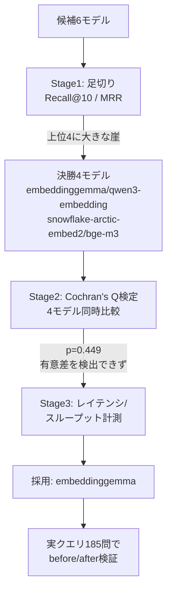

[gbrain](https://github.com/garrytan/gbrain) は個人のローカル環境でRAG的なナレッジ基盤を手軽に動かせるOSSだが、検索精度を左右する埋め込みモデルの選定はデフォルトのまま使う人が多いはずだ。今回、既定の `nomic-embed-text` から自前で選定したモデルに差し替えて、実際にgbrainへの質問がどれだけ当たるようになったかを検証した。

結論を先に示すと、判断の流れはこうだ。

> **6候補を足切り → 上位4候補は統計的に有意差を検出できず → 決着はレイテンシ/スループットという測れる指標に委ねた → `embeddinggemma` を採用し、実クエリでの的中率がほぼ倍になった。**

同じ「感想ではなく検証で技術選定を決める」という流れは、以前書いた「LLM-as-Judgeの使いどころ」というRAG生成モデル選定の記事とも共通している。あちらは生成モデル、こちらは埋め込みモデルという違いはあるが、方法論は同型だ。



## 1. gbrainとは

gbrainは、Y CombinatorのCEOであるGarry Tan氏が公開しているオープンソースのナレッジランタイムだ。単純な「ベクトル検索してヒットしたページを返すRAG」ではなく、複数ページを横断して合成した回答を、出典と「まだ分かっていないこと」の注記つきで返す点を売りにしている。

技術的には Postgres+pgvector(ローカルはDocker不要のPGLite)を土台に、ベクトル検索とキーワード検索のハイブリッド、書き込み時に自動配線されるナレッジグラフ、リランカーを組み合わせた4段構えの検索を行う。Claude CodeなどにMCPサーバーとして接続すれば、`gbrain search`/`gbrain think` でエージェントの記憶層として使える。

私にとっての主な価値は、この構成一式を`gbrain init`だけで個人環境に立ち上げられる手軽さにある。以降の話は、この「手軽さ」の中で唯一チューニングを要した箇所――埋め込みモデル選定――についての記録だ。

## 2. RAG実装の大半は自動化されているが、埋め込みモデルだけは選ぶ価値がある

gbrainはチャンク分割・ベクトルDBの初期化・検索パイプラインの配線までを内蔵しているため、自分でRAGを設計する作業はほぼ発生しない。個人がゼロから構築するときに時間を取られがちな部分――チャンクサイズの調整、ベクトルDBのスキーマ設計、ハイブリッド検索の実装――を肩代わりしてくれる。

その一方で、検索精度に最も直接効くパラメータである**埋め込みモデル**は差し替え可能なプラグイン点として残されている。gbrainのOllama向けレシピは`nomic-embed-text`(768次元)を既定としているが、これは「とりあえず動く」ための選択であり、自分のコーパスに対して最も精度が出るモデルとは限らない。パイプラインの設計コストがほぼゼロになった分、残った自由度をどう使うかがそのままRAGの検索精度に跳ね返る構造になっている。そこで、実際に埋め込みモデルを比較検証して選び直すことにした。

## 3. 埋め込みモデル比較検証

### 評価セットの前提

自分のgbrainコーパス(zenn-content・tool-calling系リポジトリのメモ・記事など521チャンク)に対して、185件のクエリで評価した。内訳は次の通りで、この比率は精度の解釈に直接影響するため先に開示しておく。

- **curated 35問**: 手動で作成。正解は「どのページ(slug)から答えられるか」で判定
- **auto 150問(全体の81%)**: チャンク本文からLLM(`qwen3.5:4b`)に質問文を生成させた合成クエリ。正解チャンクIDが生成時点で既知なので、`chunk_id`の完全一致で判定

言葉だけだと両者の違いが伝わりにくいので、同じページ(vlm-vs-yoloの検証レポート)を正解とする実例を並べる。

| 種別 | クエリ | 正解の判定単位 |
| --- | --- | --- |
| curated | 「YOLOとVLMの精度が互角なとき、最終的に何で意思決定した?」 | ページ全体(slug一致) |
| auto | 「意思決定ルールにおける二象限の判定基準とは何か。」 | 特定の1チャンク(chunk_id完全一致) |

curatedは自分がページの内容を思い出しながら書いた、人間が実際に投げそうな粒度の質問。autoはLLMが1チャンク分の文章だけを見て「この段落に書いてあることを聞く質問」を生成したもので、質問の作り方自体が答えの段落に強く紐づく。そのため、正解チャンクとの意味的な近さは人間の自然な質問より高くなりやすい。したがって以下のRecall/MRRの絶対値は、実際の利用シーンよりやや高めに出ている可能性がある。モデル間の**相対順位**を見る評価だと理解してほしい。

### Stage1: 足切り(Recall@10 / MRR)

候補6モデルを対象に、Recall@10とMRRを算出した(K=10、n=185)。

| モデル | Recall@10 | MRR |
| --- | --- | --- |
| embeddinggemma | 0.919 | **0.741** |
| qwen3-embedding | 0.908 | 0.731 |
| snowflake-arctic-embed2 | 0.886 | 0.705 |
| bge-m3 | 0.908 | 0.700 |
| nomic-embed-text(既定) | 0.632 | 0.394 |
| all-minilm | 0.314 | 0.149 |

上位4モデルはMRR 0.700〜0.741の範囲に密集する一方、5位の`nomic-embed-text`との間には0.306ポイントの崖がある。この崖を足切りの基準にし、上位4モデルを決勝に進めた。既定モデルであるnomic-embed-text自身が、この時点で早くも下位に沈んでいる。

### Stage2: 決勝4モデルの有意差検定

決勝4モデルの当たり/外れ(hit@10の二値)を同じ185問で揃え、**Cochran's Q検定**で4モデル同時に差があるかを検定した。

```
Q = 2.6512, df = 3, p = 0.4486
```

p=0.449 (α=0.05) であり、**4モデル間に統計的な有意差を検出できなかった**。これは「4モデルが同等であることを示した」わけではなく、あくまで「この検定・このNでは差を検出する力がなかった」という限定的な結論だ。n=185・Recall約0.9付近では不一致ペア数自体が少なく、検定の検出力は高くない。この前提を明示した上で、事前登録した設計どおり次段のタイブレーカーに進む。

### Stage3: レイテンシ/スループットで決着

品質面で差がつかない以上、決着は測れば揺るがない指標に委ねる。4モデルそれぞれをOllama常駐のまま、以下2種類を実測した。

- **単発クエリのレイテンシ**: 短いクエリ1件を15回連続で投げ、中央値を取る
- **バッチ投入のスループット**: コーパスから200チャンクを batch=32 で流し込む

| モデル | パラメータ | 次元 | 単発(中央値,ms) | 200件バッチ(s) | スループット(chunks/s) |
| --- | --- | --- | --- | --- | --- |
| qwen3-embedding | 596M | 1024 | 2100 | 686.5 | 0.29 |
| **embeddinggemma** | **308M** | **768** | 2153 | **114.4** | **1.75** |
| snowflake-arctic-embed2 | 567M | 1024 | 2231 | 266.4 | 0.75 |
| bge-m3 | 567M | 1024 | 2236 | 266.0 | 0.75 |

単発クエリの中央値は2.1〜2.2秒台にほぼ横並びで、パラメータ数が308M〜596Mまでばらついているにもかかわらず差が6%以内に収まっている。単発呼び出しでは何らかの固定コストが計算量差を覆い隠している可能性が高いが、その要因(通信・モデルスワップ等)までは今回切り分けていない。差がはっきり出るのはバッチのスループットで、**embeddinggemmaは2位以下の2.3〜6倍速い**。個人のRAG基盤では検索の都度モデルを呼ぶより、コーパスの再インデックスや追記のたびにバッチ投入するコストの方が体感に効くため、この指標を決定打とした。

品質の点推定でも最上位(Recall@10=0.919, MRR=0.741)、パラメータ数も4候補中最小(308M)であることも踏まえ、**embeddinggemmaを採用**した。

## 4. デフォルトから選定モデルへ差し替えて実クエリで検証

最後に、選定結果が机上の評価だけでなく実際のgbrainパイプラインでも効くかを確認した。同じ185問を、既定の`nomic-embed-text`と差し替え後の`embeddinggemma`それぞれで実際にgbrainへ投げ、正解ページが返ってきた順位を記録した。

| 指標 | nomic-embed-text(既定) | embeddinggemma(選定後) |
| --- | --- | --- |
| hit@1 | 25.9% (48/185) | **58.9%** (109/185) |
| hit@3 | 36.8% (68/185) | **74.6%** (138/185) |
| hit@10 | 50.3% (93/185) | **79.5%** (147/185) |
| MRR | 0.336 | **0.676** |
| 圏外(該当なし) | 92/185 | 38/185 |

MRRはほぼ倍増、圏外だったクエリも92件から38件に減った。ちなみに`nomic-embed-text`がgbrainのOllama向けレシピの既定モデルであることは公式ドキュメントで確認済みで、今回の比較は「勝手に選んだ弱い相手」との比較ではない。

一点補足すると、実測MRRはオフラインの検証ハーネス(0.741)より低い0.676に落ちている。これはオフライン評価が「埋め込みベクトルのコサイン類似度top-kのみ」を見ているのに対し、実際のgbrainはハイブリッド検索・ナレッジグラフ・リランカーを含む本番パイプライン全体を通すためで、埋め込みモデル単体の評価と実運用の間には避けられないギャップがある。この節の価値は「nomicより悪い」ことの再発見(それはStage1で既にMRR 0.394として予測済みだった)ではなく、**オフラインで選んだ差し替えが、本番パイプラインを通しても効果が生き残ることを確認できた**点にある。

## まとめ

埋め込みモデルの選定は、足切り(Recall/MRR)→有意差検定(Cochran's Q)→測れる指標での決着(スループット)→実パイプラインでの再検証、という4段の検証を経て決めた。特に「p=0.449だから同等」と言い切らず「有意差を検出できなかった」と限定的に読んだことと、机上の評価で終わらせず実クエリで裏を取ったことが、この選定で一番効いた技術判断だと考えている。
