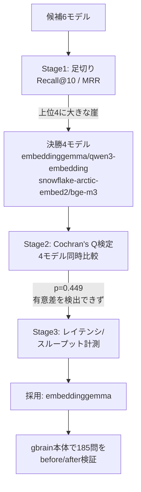

gbrainは個人のローカル環境でRAG的なナレッジ基盤を手軽に動かせるOSSだが、検索精度を左右する埋め込みモデルの選定はデフォルトのまま使う人が多いはずだ。今回、既定の `nomic-embed-text` から自前で選定したモデルに差し替えて、実際にgbrainへの質問がどれだけ当たるようになったかを検証した。

> **6候補を足切り → 上位4候補は統計的に有意差を検出できず → 決着はレイテンシ/スループットという測れる指標に委ねた → `embeddinggemma` を採用し、gbrain本体での検索精度(MRR)がほぼ倍になった。**

🔗 **検証コード・再現手順**: [github.com/yuya0408/gbrain-embedding-eval](https://github.com/yuya0408/gbrain-embedding-eval)


```mermaid
flowchart TD
    A["候補6モデル"] --> B["Stage1: 足切り<br/>Recall@10 / MRR"]
    B -->|"上位4に大きな崖"| C["決勝4モデル<br/>embeddinggemma/qwen3-embedding<br/>snowflake-arctic-embed2/bge-m3"]
    C --> D["Stage2: Cochran's Q検定<br/>4モデル同時比較"]
    D -->|"p=0.449<br/>有意差を検出できず"| E["Stage3: レイテンシ/<br/>スループット計測"]
    E --> F["採用: embeddinggemma"]
    F --> G["gbrain本体で185問を<br/>before/after検証"]
```

## 1. gbrainとは

**gbrainは、3段構えの検索を備えたナレッジ基盤を`gbrain init`だけで個人環境に立ち上げられるOSSだ。**

Y CombinatorのCEOであるGarry Tan氏が公開しているナレッジランタイムで、単純な「ベクトル検索してヒットしたページを返すRAG」ではなく、複数ページを横断して合成した回答を、出典と「まだ分かっていないこと」の注記つきで返す点を売りにしている。

技術的には Postgres+pgvector(ローカルはDocker不要のPGLite)を土台に、ベクトル検索とキーワード検索のハイブリッド、書き込み時に自動配線されるナレッジグラフを組み合わせた3段構えの検索を行う。Claude CodeなどにMCPサーバーとして接続すれば、`gbrain search`/`gbrain think` でエージェントの記憶層として使える。以降は、この構成の中で唯一チューニングを施した埋め込みモデル選定の記録である。

→ [gbrain (GitHub)](https://github.com/garrytan/gbrain)

## 2. 埋め込みモデルを個人最適化してみた

**パイプラインの中で、検索精度に直接効く埋め込みモデルをデフォルトのものから選定しなおした。**

gbrainはチャンク分割・ベクトルDBの初期化・検索パイプラインの配線までを内蔵しており、チャンクサイズの調整、ベクトルDBのスキーマ設計、ハイブリッド検索の実装といった、個人がゼロから構築するときに時間を取られがちな部分を肩代わりしてくれる。一方で埋め込みモデルは差し替え可能なプラグイン点として残されている。gbrainのOllama向けレシピは`nomic-embed-text`(768次元)を既定としているが、これは「とりあえず動く」ための選択で、手元のコーパスに対して最も精度が出るモデルとは限らない。

## 3. 埋め込みモデル比較検証

**品質では上位4モデルを統計的に区別できず、スループットで決着させて`embeddinggemma`を採用した。**

### 評価セットの前提

**合成クエリが8割を占めるため、Recall/MRRの絶対値は実利用より高めに出る。この評価はモデル間の相対順位を見るものだ。**

個人で運用している複数リポジトリのメモ・記事など521チャンクのgbrainコーパスに対して、185件のクエリで評価した。

- **curated 35問**: 手動で作成。正解は「どのページ(slug)から答えられるか」で判定
- **auto 150問(全体の81%)**: チャンク本文からLLM(`qwen3.5:4b`)に質問文を生成させた合成クエリ。正解チャンクIDが生成時点で既知なので、`chunk_id`の完全一致で判定

同じページ(別プロジェクトの検証レポート)を正解とする実例は次の通り。

| 種別 | クエリ | 正解の判定単位 |
| --- | --- | --- |
| curated | 「YOLOとVLMの精度が互角なとき、最終的に何で意思決定した?」 | ページ全体(slug一致) |
| auto | 「意思決定ルールにおける二象限の判定基準とは何か。」 | 特定の1チャンク(chunk_id完全一致) |

curatedはページの内容を思い出しながら書いた、人間が実際に投げそうな粒度の質問だ。autoはLLMが1チャンクだけを見て生成した質問なので、答えの段落との意味的な近さが人間の自然な質問より高くなる。

### Stage1: 足切り(Recall@10 / MRR)

**上位4モデルと既定の`nomic-embed-text`の間にMRRで0.306ポイントの崖があり、ここを足切りの基準にした。**

候補はOllama公式ライブラリで提供される埋め込みモデル6つに限定し、Recall@10(正解が上位10件に入ったクエリの割合)とMRR(正解の順位の逆数の平均)を算出した(n=185)。

| モデル | Recall@10 | MRR |
| --- | --- | --- |
| embeddinggemma | 0.919 | **0.741** |
| qwen3-embedding | 0.908 | 0.731 |
| snowflake-arctic-embed2 | 0.886 | 0.705 |
| bge-m3 | 0.908 | 0.700 |
| nomic-embed-text(既定) | 0.632 | 0.394 |
| all-minilm | 0.314 | 0.149 |

上位4モデルはMRR 0.700〜0.741に密集し、既定のnomic-embed-textはこの時点で早くも下位に沈んでいる。

### Stage2: 決勝4モデルの有意差検定

**4モデル間に統計的な有意差は検出できなかった(p=0.449)。**

決勝4モデルのhit@10(クエリごとの当たり/外れの二値)を同じ185問で揃え、Cochran's Q検定(McNemar検定のk群版)で4モデル同時に差があるかを検定した。

```
Q = 2.6512, df = 3, p = 0.4486
```

「同等を示した」のではなく「このNでは差を検出する力がなかった」という限定的な結論だ。hit@10は4モデルとも0.886〜0.919と上限付近に張り付き、片方だけが当たるクエリが少ない。そこで順位差に敏感なhit@1でも事後的に同じ検定をかけたが、結果は変わらなかった(Q=4.26, df=3, p=0.235)。事前登録した設計どおり次段のタイブレーカーに進む。

### Stage3: レイテンシ/スループットで決着

**単発レイテンシは横並びで、差はバッチスループットにだけ出た。embeddinggemmaは2位以下の2.4〜6.5倍速い。**

計測環境はノートPC(AMD Ryzen 5 7520U・メモリ16GB、専用GPUなしのCPU推論)で、4モデルそれぞれをOllama常駐のまま以下2種類を各1回実測した。

- **単発クエリのレイテンシ(1件の応答時間)**: 短いクエリ1件を15回連続で投げ、中央値を取る
- **バッチ投入のスループット(1秒あたりの処理件数)**: コーパスから200チャンクを、gbrain本体の送信単位と同じ batch=100 で流し込む

| モデル | パラメータ | 次元 | 単発(中央値,ms) | 200件バッチ(s) | スループット(chunks/s) |
| --- | --- | --- | --- | --- | --- |
| qwen3-embedding | 596M | 1024 | 2076 | 683.4 | 0.29 |
| **embeddinggemma** | **308M** | **768** | 2104 | **105.8** | **1.89** |
| snowflake-arctic-embed2 | 567M | 1024 | 2199 | 256.5 | 0.78 |
| bge-m3 | 567M | 1024 | 2195 | 254.9 | 0.78 |

単発クエリの中央値は、パラメータ数が308M〜596Mとばらつくのに差が6%以内に収まり、候補を区別できない(固定コストの要因は切り分けていない)。差が出るのはバッチのスループットで、これはモデル切り替え時の全件再埋め込み(`gbrain migrate-embeddings`)や初回取り込みに直接効く。今回の521チャンクなら、embeddinggemmaは約5分、qwen3-embeddingは約30分かかる。だからスループットを決定打とした。

品質の点推定でも最上位(Recall@10=0.919, MRR=0.741)、パラメータ数も4候補中最小(308M)であることも踏まえ、embeddinggemmaを採用した。

## 4. デフォルトから選定モデルへ差し替えてgbrain本体で検証

**オフラインで選んだ差し替えは、本番のgbrainパイプラインを通してもMRRを0.336から0.676へほぼ倍にした。**

同じ185問を、既定の`nomic-embed-text`と差し替え後の`embeddinggemma`それぞれで実際にgbrainへ投げ、正解が返ってきた順位を記録した。

| 指標 | nomic-embed-text(既定) | embeddinggemma(選定後) |
| --- | --- | --- |
| hit@1 | 25.9% (48/185) | **58.9%** (109/185) |
| hit@3 | 36.8% (68/185) | **74.6%** (138/185) |
| hit@10 | 50.3% (93/185) | **79.5%** (147/185) |
| MRR | 0.336 | **0.676** |
| 圏外(該当なし) | 92/185 | 38/185 |

圏外だったクエリは92件から38件に減った。hit@10で片方だけが当たったクエリはembeddinggemma側57件・nomic側3件で、exact McNemar検定でもp<10⁻¹³と明確に有意だ。なお`nomic-embed-text`がgbrainのOllama向けレシピの既定であることは公式ドキュメントで確認済みで、恣意的に選んだ弱い相手との比較ではない。

実測MRRはオフラインの検証ハーネス(0.741)より低い0.676に落ちている。オフライン評価は埋め込みベクトルのコサイン類似度top-kだけを見るのに対し、実際のgbrainはキーワード検索(BM25)とベクトル検索の融合やクエリ展開を含むパイプライン全体を通す。このギャップは埋め込みモデル単体の評価と実運用の間で避けられない。

## まとめ

**gbrainのように既定値のまま動く便利なツールでも、埋め込みモデルは自分のナレッジとクエリに合わせてチューニングする価値があり、既定から差し替えるだけでgbrain本体でのMRRは0.336から0.676へほぼ倍になった。**

足切り(Recall/MRR)→有意差検定(Cochran's Q)→測れる指標での決着(スループット)→実パイプラインでの再検証という4段の検証を経て、既定の`nomic-embed-text`から`embeddinggemma`へ差し替えた。
<!-- gbrain: [Source: User, 記事執筆・公開, 2026-09-30] -->
