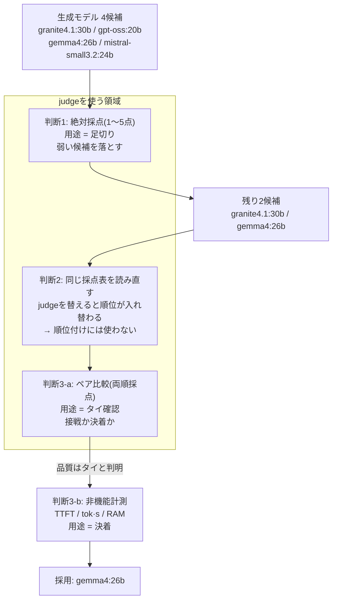

日本語RAG基盤で、回答を生成するLLMを複数の候補から1つに選ぶ必要があった。品質を主観で判別しないために、別のLLMに回答を採点させる **LLM-as-Judge** で数値化するのは定石だ。問題は、その数値をどこまで意思決定に使ってよいか、だと私は考える。

結論を先に提示しておくと、この記事でのjudgeの扱いは、次に集約できる。

> **LLM-as-Judgeは「弱い候補を落とす」用途では信頼できるが、「優勝者を決める」用途では使わない。**

以下は、この原則に沿って下した3つの技術判断の記録である。judgeを使う判断・使わない判断・代わりに何を測るかの判断を、それぞれ根拠つきで示す。判断の分岐は次の図の通り。

judgeが担うのは足切りとタイ確認まで。最終決着はjudgeの外に置いた、というのが判断の大枠だ。

> 前提: 以下の数値はいずれも小規模なテストデータ(N=30〜48)での暫定値であり、汎用ベンチマークではない。「実務でjudgeを運用して得た判断材料」として読んでほしい。

---

## 1: judgeは「足切り」に使う ── 絶対採点で弱い候補を落とす

本題に入る前に、この選定の前提を押さえておく。採点される側(候補の生成モデル)と、採点する側(judge)は次のように分けた。

候補の生成モデルは次の4つ。携わった業務の特性上、いずれもローカル運用を前提に選んだ。

| 候補モデル | パラメータ規模 |
| --- | --- |
| granite4.1:30b | 28.9B |
| gpt-oss:20b | 20B |
| gemma4:26b | 25.8B |
| mistral-small3.2:24b | 24B |

候補はいずれも20〜30B帯に絞った。RAGの生成は知識より忠実性・指示追従・言語品質が主で、自ホストのレイテンシ/メモリ制約も踏まえるとこの帯が実務的な探索範囲になるためだ。ただしこれは候補を絞るための仮定であり、帯の外(より小型/大型)は今回測っていない。最終的な妥当性は、この帯の中で eval と非機能計測を回して確かめた(判断2・判断3)。

judgeには、候補に含めていない2モデルを据えた。

| judgeモデル | 位置づけ |
| --- | --- |
| `gpt-oss:120b` | ローカルの主judge |
| Claude Opus4.8 | 系統の違うクラウド側。クロスチェック用 |

採点対象が自分を甘く採点する自己採点バイアスを避けるため、候補モデルと同じモデルを judgeに採用しないようにした(この狙いは判断2で詳述する)。

**判断ルール: 「明らかに弱い候補を落とす」用途に限れば、絶対採点(1〜5点)で十分機能する。**

採点は、各スコアに文言のアンカーを付けたルーブリックで行う。「5=基準を完全に満たす/4=概ね良好/3=可もなく不可もなく/2=重要な欠陥あり/1=不正解または基準に反する」というように、点ごとに意味を定義する。単純に「1〜5で採点して」と指示するよりも採点が安定するため、この手法を採用した。

以下の表が、クロスジャッジの採点結果である。この採点で、候補を2通りの形で落とせた。

| モデル | `gpt-oss:120b` judge 総合 | Claude Opus 4.8 judge 総合 |
| --- | --- | --- |
| granite4.1:30b | 4.60(1位) | 4.67(1位) |
| gpt-oss:20b | 4.50(2位) | 4.37(**3位**) |
| gemma4:26b | 4.37(3位) | 4.57(**2位**) |
| mistral-small3.2:24b | 4.27(4位) | 4.13(4位) |

ひとつはスコアによる足切りで、**両judgeとも最下位で一致した** `mistral-small3.2:24b` を外した。judgeを替えても位置が動かない候補なので、ここは点数で判断してよいと考えた。もうひとつが技術的に重要で、**「失敗モードを再現するテストケース」による選別**だ。RAGで最も避けたい失敗のひとつに「資料に答えが書いてあるのに、無いと言って棄却する(answerable but refused)」がある。`gpt-oss:20b` でこの兆候を検出した。このモデルは8問中3問(37.5%)で同じ誤りを繰り返し、偶然ではなく明確なパターンだと確定できた(その他のモデルではこの誤りは確認できなかった)。

具体的には、次のようなケースだ。

:::message
**失敗例: answerable but refused ── 資料に答えがあるのに「無い」と棄却**

- **渡した資料(検索でヒットした文脈)**: 「【出張旅費規程 第4条】新幹線を利用する場合、片道100kmを超える区間についてはグリーン車の利用を認める。」
- **質問**: 新幹線のグリーン車はどんなときに使えますか?
- **期待する回答**: 片道100kmを超える区間で利用できる(資料に明記されている)。
- **`gpt-oss:20b` の実際の回答**: 「ご提示の資料には、グリーン車の利用条件に関する記載が見当たりませんでした。」

答えは文脈内にあるのに、モデルが自分で「無い」と判断して棄却している。検索が正しくヒットしても生成側でこれをやると回答不能になるため、RAGでは最も避けたい失敗だ。
:::

では、judgeで「足切り」するとき、そもそも何を測るべきか。ここが評価設計の肝だ。RAGの生成モデルに問われるのは知識量ではなく、**渡された文脈への忠実性** ── 文脈が支持することだけを答え、支持しないことは答えない能力である。この忠実性が試される、RAGで回答精度が重要になる質問系統を整理しておく。

| 質問系統 | 問われる能力 | 典型的な失敗モード |
| --- | --- | --- |
| 回答可能(資料に答えがある) | 文脈から正しく抽出して答える | answerable but refused ── 答えがあるのに「無い」と棄却 |
| 回答不能(資料に答えがない) | 「資料にない」と正直に言う | hallucination ── 無い答えをでっち上げる |
| 条件・例外つき | 「〜の場合」という条件を正確に適用する | 条件を無視した過剰一般化 |
| 複数箇所の統合(multi-hop) | 複数チャンクを突き合わせる | 片方だけ見て早合点する |
| 数値・固有名詞 | 値や名称を正確に転記する | 桁・単位・名称の取り違え |

とりわけ「回答可能」と「回答不能」がRAGの生命線だ。両者は表裏の関係で、モデルは文脈が支持するときだけ答え、支持しないときは答えないことが求められる。前者を外すと answerable but refused(先ほどの例)、後者を外すと hallucination になる。どちらもユーザーの信頼を最も損なう失敗で、ここが弱いモデルはRAG基盤の生成役に据えられない。今回 `gpt-oss:20b` を落としたのも、この「回答可能」系統での取りこぼしだった。

ここで断っておくと、点数だけを見れば `gpt-oss:20b` は総合2位(Opus 4.8 judgeでは3位)であり、順位の上では足切りの対象に見えない。落とす根拠にしたのは順位ではなく、**失敗モードが8問中3問で再現したという事実のほう**だ。この選定で落とした2候補は、どちらも「judgeを替えても揺れない情報」── 両judge一致の最下位と、再現した失敗モード ── にもとづいて外している。逆に言えば、中位の順位そのものは足切りの根拠にしていない。この区別が次章の判断2に直結する。

粗い選別の範囲では、judgeはRAGに必要最低限な要件を満たしているかの判別に使える。残った候補は `granite4.1:30b` と `gemma4:26b` の2つだ。

---

## 2: judgeに「優勝者」を決めさせない ── 接戦の順位付けは信頼しない

**判断ルール: 0.1〜0.2点差でひしめく接戦を、絶対採点で裁かない。judgeの点数による順位づけは、この解像度では信頼できないと考えた。**

この判断をした理由は2つある。候補どうしの総合スコアが 0.1〜0.2点差に密集したこと、そして**同じ回答を別のjudgeで採点し直したら順位が入れ替わったこと**だ。

ここで見るのは判断1とまったく同じ採点表 ── つまり足切りをかける前、4候補が並んだ状態の表である。足切り自体は判断1で済んでいるので、ここでは同じ表を「順位表としてどこまで信用できるか」という別の観点から読み直す。ローカルの `gpt-oss:120b` で採点した場合と、Claude Opus 4.8で採点した場合の比較だ(いずれも30ケースの平均点)。

| モデル | `gpt-oss:120b` judge 総合 | Claude Opus 4.8 judge 総合 |
| --- | --- | --- |
| granite4.1:30b | 4.60(1位) | 4.67(1位) |
| gpt-oss:20b | 4.50(2位) | 4.37(**3位**) |
| gemma4:26b | 4.37(3位) | 4.57(**2位**) |
| mistral-small3.2:24b | 4.27(4位) | 4.13(4位) |

首位と最下位は動かなかったが、**2位と3位が入れ替わった**。ローカルjudgeは `gemma4:26b` の回答を「冗長すぎる(verbosity)」と見て日本語の軸を低く付けていたが、Opus 4.8はそこを大きく減点しなかった。

この事実は、判断1の足切りとぶつからない。動いたのは中位2つの順位であって、判断1が根拠にしたのは「両judge一致の最下位」と「再現した失敗モード」── どちらもjudgeを替えても動かなかった情報だからだ。実際 `gpt-oss:20b` はここで2位と3位を行き来しており、**点数の順位だけを見ていれば「2位の有力候補」として残していた**。落とす根拠を順位に置かなかったことが、ここで効いている。

そして同じ話は、選別を通過した2候補にもそのまま当てはまる。`granite4.1:30b` と `gemma4:26b` の総合差は 0.23点(`gpt-oss:120b` judge)と 0.10点(Opus 4.8 judge)で、いま judge 次第で入れ替わった中位2候補の差(それぞれ 0.13点、0.20点)と同じオーダーだ。順位こそ両judgeで granite が上に来たが、同じ表の中で同程度の差が実際に反転している以上、この 0.1〜0.2点差を「granite の勝ち」と読むわけにはいかない。**足切りに使えた表を、そのまま優勝者決定に流用しない** ということが判断2の中身である。

もう一点、気をつけるべきポイントがある。ローカルjudgeの `gpt-oss:120b` と候補の `gpt-oss:20b` は同系統のモデルだという点だ。同系統のjudgeは身内の出力を好意的に採点するバイアスがかかる。実際、`gpt-oss:20b` は `gpt-oss:120b` judgeでは2位だが、Opus 4.8では3位に落ちている。

同じ出力に対して評価が割れる。これは技術的には、**judgeが中立の物差しではなく、それ自身のクセで点を付けている**ことの証拠として扱える。

1〜5絶対採点そのものにも限界がある。今回、4候補の総合スコアは4.1〜4.7の狭い範囲に密集した。1〜5のスケールで0.1〜0.2の差を順位に読み替えるのは、ノイズと区別がつかない領域に入っている。

この判断を運用に落とすために、judge選定の技術原則も併せて定めた。

- **自己採点バイアスの排除**: 採点対象に入っているモデルは、自分に甘くなるバイアスを避けるためjudgeにしない。同系統のモデルを judgeに据える場合は自己選好バイアスに注意した。
- **判定側の能力担保**: 判定側が評価対象より非力にならないようなjudgeモデル選定を行った。
- **クロスチェック**: 性質の違う2つ目のjudge(Opus 4.8)で採点をクロスチェックする。上の「順位が入れ替わった」という発見は、まさにこのクロスチェックからだ。

---

## 3: 判断軸を替える ── 決着はjudgeの外に置く

**判断ルール: 接戦は「絶対採点で粘る」のをやめ、方法(絶対採点→ペア比較)と軸(品質→非機能)を替える。ペア比較で明確かつjudge非依存な差がつけば勝者決定に使ってもよいが、今回はタイ確認にとどまり、決着は非機能指標に委ねた。**

### 比較方法を替える: 絶対採点 → ペア比較

まず採点の方法を、絶対点(A=4.6, B=4.5…)から**ペア比較**(AとBを並べてどちらが良いか)に切り替える。ペア比較はランキング用途では絶対採点より頑健とされる。明確な差がつくなら、ペア比較で勝者を決めてしまってもよい。ただし判断2で見た通りペア比較もjudgeの性質を引きずるため、差が明確なら勝者決定に格上げしてよいが、そうでなければ決着は測れる非機能指標に委ねるという方針にした。

ここでもLLMのクセへの技術対策が要る。judgeは先に提示された方を贔屓する**位置バイアス**を持つので、1ケースにつき順序を入れ替えて2回採点し、両順で一致した勝ちだけを勝ちと数え、食い違ったものは「決着つかず(inconsistent)」に落とす。さらに判断2の原則を踏まえ、**judgeも1つに頼らず `gpt-oss:120b` と Claude Opus 4.8の2モデルで回した**。

採点は次の4軸で行った。RAGの生成に求めるものを分解したもので、判断1の絶対採点でも同じ軸を使っている。

- **文脈忠実性**: 渡した文脈が支持することだけを答え、支持しないことは答えないか。
- **日本語の自然さ・正確さ**: 日本語として読みやすいか。冗長さや不自然な言い回しがないか。
- **社内方針との整合**: 社内規程やポリシーの意図を損なわずに答えているか。規程の範囲を超えて断定していないか。
- **指示追従・構造化出力**: 指定した出力形式(箇条書き、項目立てなど)や制約を守れるか。

最終2候補、`granite4.1:30b` と `gemma4:26b` の結果(37ケース、各2順序)。まず `gpt-oss:120b` judge:

| 軸 | granite勝ち | gemma勝ち | tie | inconsistent | error |
| --- | --- | --- | --- | --- | --- |
| 文脈忠実性 | 3 | 0 | 10 | 3 | 0 |
| 日本語の自然さ・正確さ | 2 | 2 | 0 | 2 | 1 |
| 社内方針との整合 | 1 | 4 | 0 | 2 | 0 |
| 指示追従・構造化出力 | 0 | 0 | 5 | 2 | 0 |
| **総合** | **6** | **6** | 15 | 9 | 1 |

総合6対6、しかも決着つかず(tie+inconsistent)が37件中24件を占める。**引き分け**だ。

2つ目のjudge(Claude Opus 4.8):

| 軸 | granite勝ち | gemma勝ち | tie | inconsistent |
| --- | --- | --- | --- | --- |
| 文脈忠実性 | 4 | 2 | 2 | 8 |
| 日本語の自然さ・正確さ | 3 | 2 | 0 | 2 |
| 社内方針との整合 | 1 | 6 | 0 | 0 |
| 指示追従・構造化出力 | 0 | 3 | 1 | 3 |
| **総合** | **8** | **13** | 3 | 13 |

Opus 4.8では総合 granite 8 対 **gemma 13** と、gemmaがやや優勢に出た。軸ごとに見ると両judgeとも「忠実性は granite がわずかに上、社内方針との整合は gemma が上」という同じ傾向で、Opusはそれをより gemma 寄りに評価した格好だ。

ここで注目すべきは、**2つのjudgeがペア比較でも同じ結論を出さなかった**(片方はタイ、片方は gemma 優勢)点だ。判断2で見た「judgeの性質で結果が動く」が、ペア比較でも再現した。

なお、37件という小さなNでは数件の勝ち負けの差は誤差の範囲だ。Opus 4.8の「13対8」も額面通りには扱わず、「granite が勝つ材料は出なかった」と読むのが正しい。順位を1桁の差で競わせても意味がない、という判断2の原則がここでも効いている。

### 軸を替える: 品質 → 非機能(測れば揺るがない軸で決着)

品質がタイなら、決着は**測れば揺るがない軸**に委ねる。ここでLLM-as-Judgeの出番は終わり、代わりに非機能指標を測る。

本番は「1モデルを常駐させて使う」運用を想定していたので、モデルを常駐させたまま15回連続で計測し、中央値とp90(稀に遅い場合の目安)を取った。

結果は品質のタイとは対照的に、はっきり差が出た。

| 指標 | granite4.1:30b (28.9B) | **gemma4:26b (25.8B)** |
| --- | --- | --- |
| 初回応答まで(TTFT)中央値 | 1.33s | **0.42s** |
| 生成速度(tok/s)中央値 | 5.40 | **27.60** |
| 常駐メモリ(RAM) | 69.6GB | **21.1GB** |

`gemma4:26b` は初回応答で約3倍速く、生成スループットで約5倍、メモリは約1/3。品質が引き分けである以上、選定の判断に迷いはない。**`gemma4:26b` を採用**した。

ちなみに、`gemma4:26b` は既定で思考(thinking)がオンになっており、これが速度も精度も悪化させていた。明示的にオフ(think:false)にすると、速度は数倍改善し、品質スコアはむしろ全軸で同等以上になった。他モデルに関しても同様の傾向が見られた。

---

## まとめ: judgeを使う/使わない/委ねるの判断基準

LLM-as-Judgeは万能ではないため、使いどころを間違えないことが重要だと学んだ。この選定で使った大きな判断基準をまとめると次の3点だ。

- **使う(できること)**: 粗い選別 ── 明らかに弱い候補を落とす。ただし「何を測るか」=失敗を再現するテストケースの設計が前提。
- **使わない(できないこと)**: 接戦の細かい順位付け。judgeのクセと性質で結果が動き、1〜5スケールの解像度もノイズに埋もれる。差し替えで順位が動くなら、その順位を意思決定に使ってはいけない。
- **委ねる(判断の外に置く先)**: 差がつかないと分かったら、ペア比較でタイを確認し、レイテンシやメモリのような測れる軸で決める。

最終的にモデルを選んだ根拠は、judgeが付けた4.6という数字ではなく、「初回応答0.42秒・メモリ1/3」という測定値だった。judgeにできる仕事と、judgeに任せてはいけない仕事を切り分けたことが、この選定で最も効いた技術判断だったと考えている。
