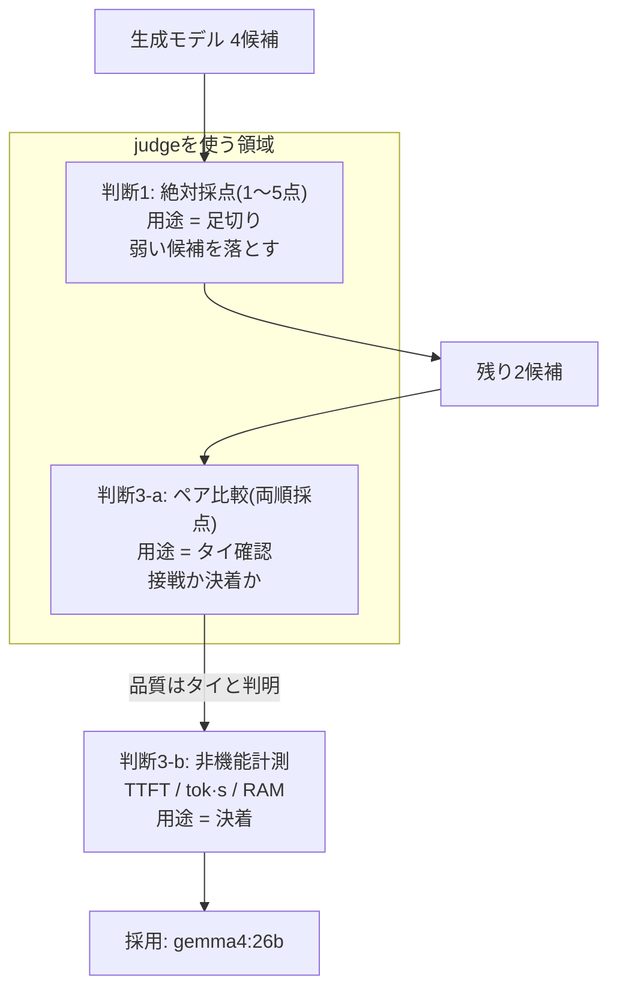

社内向けの日本語RAG基盤で、回答を生成するLLMを複数の候補から1つに選ぶ必要があった。品質を主観で決めたくないので、別のLLMに回答を採点させる **LLM-as-Judge** で数値化する ── ここまでは定石だ。問題は、その数値をどこまで意思決定に使ってよいか、である。

結論を先に置く。この選定でのjudgeの扱いは、次の技術的原則に集約できる。

> **LLM-as-Judgeは「弱い候補を落とす」用途では信頼できるが、「優勝者を決める」用途では信頼できない。最終決着はjudgeの点数の外に置く。**

以下は、この原則に沿って下した3つの技術判断の記録である。judgeを使う判断・使わない判断・代わりに何を測るかの判断を、それぞれ根拠つきで示す。判断の分岐は次の図の通り。

judgeが担うのは足切りとタイ確認まで。最終決着はjudgeの外にある、というのが判断の骨子だ。

> 前提: 以下の数値はいずれも小規模なテストデータ(N=30〜48・単一プロジェクト)での暫定値であり、汎用ベンチマークではない。「実務でjudgeを運用して得た判断材料」として読んでほしい。

---

## 判断1: judgeは「足切り」に使う ── 絶対採点で弱い候補を落とす

**判断ルール: 「明らかに弱い候補を落とす」用途に限れば、絶対採点(1〜5点)で十分機能する。**

採点は、各スコアに文言のアンカーを付けたルーブリックで行う。「5=基準を完全に満たす/4=概ね良好/3=可もなく不可もなく/2=重要な欠陥あり/1=不正解または基準に反する」というように、点ごとに意味を定義する。素の「1〜5で採点して」より一段安定するため、足切り用途ではこの作法を採る。

この採点で、候補を2通りの形で落とせた。

ひとつはスコアによる足切りで、総合で最下位だった `mistral-small3.2:24b` がこれで外れる。もうひとつが技術的に重要で、**「失敗モードを再現するテストケース」による脱落**だ。RAGで最も避けたい失敗のひとつに「資料に答えが書いてあるのに、無いと言って棄却する(answerable but refused)」がある。`gpt-oss:20b` でこの兆候を検出したので、同じ型の問題を追加して系統的に再現するかを確認した。結果、このモデルは8問中3問(37.5%)で同じ誤りを繰り返し、偶然ではなく明確なパターンだと確定できた。

ここで、この判断が成立するための技術的条件を明示しておく。「特定モデルの弱点を再現する問題を作れば、そのモデルだけ不利になるのでは?」というチェリーピッキング(出来レース)の懸念は正当だ。これを回避するには、次の4条件を満たす必要がある。

1. 測っているのが**アプリの要件そのものの能力**であること。「answerable but refused」はRAGの中核要件で、モデル固有のクセを突いているわけではない。ここに弱いモデルは、狙い撃ちで不利なのではなく、本当にこの用途に向いていない。
2. **同じ"型"の新規ケース**で再現すること。最初に失敗したその入力そのものを再実行しても、丸暗記した試験になるだけで汎化能力は測れない。だから新しい問題を作って再現を見る。
3. **対照(素直な照合問題)と軸別の集計**を持ち、ひとつの弱点タイプが総合スコアを支配しないようにすること。
4. 特定1モデル専用の罠でないこと。実際、同じ型の失敗は `gemma4:26b` でも(頻度は低いが)観測され、モデル固有ではなく能力軸として一般に効いていた。

この4条件を満たす限り、正確な言明は「そのモデルを不利にする問題を作った」ではなく **「RAGに必須の能力を測ったら、そのモデルが系統的に落ちた」** になる。発見 → 新規ケースでの再現確認、という順序で検証するのが技術的に正しい。

粗い選別の範囲では、judgeは要件を満たす道具として使える。判断1はここまで。

---

## 判断2: judgeに「優勝者」を決めさせない ── 接戦の順位付けは信頼しない

**判断ルール: 0.1点差でひしめく接戦を、絶対採点で裁いてはならない。judgeの点数の順位は、この解像度では信頼できない。**

この判断ルールを採る根拠は、選別を通過した上位候補の総合スコアが 0.1点差に密集したこと、そして次の事実だ。**同じ回答を別のjudgeで採点し直したら順位が入れ替わった。** 4候補を、ローカルの `gpt-oss:120b` で採点した場合と、系統の違うクラウド側の強力なモデル(Claude Opus)で採点した場合を比べた(いずれも30ケース、同一の生成出力)。

| モデル | `gpt-oss:120b` judge 総合 | Claude Opus judge 総合 |
| :-- | --: | --: |
| granite4.1:30b | 4.60(1位) | 4.67(1位) |
| gpt-oss:20b | 4.50(2位) | 4.37(**3位**) |
| gemma4:26b | 4.37(3位) | 4.57(**2位**) |
| mistral-small3.2:24b | 4.27(4位) | 4.13(4位) |

首位と最下位は動かなかったが、**2位と3位が入れ替わった**。ローカルjudgeは `gemma4:26b` の回答を「冗長すぎる(verbosity)」と見て日本語の軸を低く付けていたが、Opusはそこを大きく減点しなかった。

同じ出力に対して評価が割れる。これは技術的には、**judgeが中立の物差しではなく、それ自身のクセ(verbosityへの好き嫌いなど)で点を付けている**ことの証拠として扱える。judgeを差し替えると順位が動く以上、その順位はモデルの品質ではなくjudgeの性質を測っている部分を含む。

背景には、1〜5絶対採点そのものの解像度限界もある。今回、4候補の総合スコアは4.1〜4.7の狭い帯に密集した。1〜5のスケールで0.1〜0.2の差を順位に読み替えるのは、ノイズと区別がつかない領域に入っている。(付け加えると「総合4.6」という値は、整数1〜5点をケース間で平均したものだ。5点満点で4.6という言葉の響きほど、実態は精密ではない。)

この判断を運用に落とすために、judge選定の技術原則も併せて定めた。

- **自己採点バイアスの排除**: 採点対象に入っているモデルは、自分に甘くなるバイアスを避けるためjudgeにしない。
- **判定側の能力担保**: 判定側が評価対象より非力にならないよう、候補外の最強クラスをjudgeに据える。
- **クロスチェック**: 性質の違う2つ目のjudge(Opus)で採点をクロスチェックする。上の「順位が入れ替わった」という発見は、まさにこのクロスチェックから出てきた。

判断2の要点は明快だ。judgeを1つだけ信じて絶対点で優勝者を決めるのは、解像度・バイアスの両面で技術的に危うい。接戦になったら、judgeにこれ以上の解像度を求めない。

---

## 判断3: 道具と軸を替える ── 決着はjudgeの外に置く

**判断ルール: 接戦は「絶対採点で粘る」のをやめ、道具(絶対採点→ペア比較)と軸(品質→非機能)を替える。ペア比較の目的は勝者決定ではなくタイの確認、決着は測れる非機能指標に委ねる。**

### 道具を替える: 絶対採点 → ペア比較(タイ確認に用途を限定)

まず採点の道具を、絶対点(A=4.6, B=4.5…)から**ペア比較**(AとBを並べてどちらが良いか)に切り替える。ペア比較はランキング用途では絶対採点より頑健とされる。ただし用途は「勝者を決める」ことではなく、**「実質タイであることを確認する」**ことに限定する。

ここでもLLMのクセへの技術対策が要る。judgeは先に提示された方を贔屓する**位置バイアス**を持つので、1ケースにつき順序を入れ替えて2回採点し、両順で一致した勝ちだけを勝ちと数え、食い違ったものは「決着つかず(inconsistent)」に落とす。さらに判断2の原則を踏まえ、**judgeも1つに頼らず `gpt-oss:120b` と Claude Opus の2モデルで回した**。

最終2候補、`granite4.1:30b` と `gemma4:26b` の結果(37ケース、各2順序)。まず `gpt-oss:120b` judge:

| 軸 | granite勝ち | gemma勝ち | tie | inconsistent | error |
| :-- | --: | --: | --: | --: | --: |
| 文脈忠実性 | 3 | 0 | 10 | 3 | 0 |
| 日本語の自然さ・正確さ | 2 | 2 | 0 | 2 | 1 |
| 理念アライメント | 1 | 4 | 0 | 2 | 0 |
| 指示追従・構造化出力 | 0 | 0 | 5 | 2 | 0 |
| **総合** | **6** | **6** | 15 | 9 | 1 |

総合6対6、しかも決着つかず(tie+inconsistent)が37件中24件を占める。**引き分け**だ。

2つ目のjudge(Claude Opus)では、集計がずれる:

| 軸 | granite勝ち | gemma勝ち | tie | inconsistent |
| :-- | --: | --: | --: | --: |
| 文脈忠実性 | 4 | 2 | 2 | 8 |
| 日本語の自然さ・正確さ | 3 | 2 | 0 | 2 |
| 理念アライメント | 1 | 6 | 0 | 0 |
| 指示追従・構造化出力 | 0 | 3 | 1 | 3 |
| **総合** | **8** | **13** | 3 | 13 |

Opusでは総合 granite 8 対 **gemma 13** と、gemmaがやや優勢に出た。軸ごとに見ると両judgeとも「忠実性は granite がわずかに上、理念アライメントは gemma が上」という同じ傾向で、Opusはそれをより gemma 寄りに評価した格好だ。

ここで技術的に注目すべきは、**2つのjudgeがペア比較でも同じ結論を出さなかった**(片方はタイ、片方は gemma 優勢)点だ。判断2で見た「judgeの性質で結果が動く」が、ペア比較でも再現した。だが今回の意思決定はこれで揺るがない。**どちらのjudgeでも granite が gemma を上回ることはなかった**からだ。片方はタイ、もう片方は gemma 優勢 ── つまり「品質を理由に granite を選ぶ根拠は、どちらのjudgeを信じても出てこない」。タイ確認という用途には、この一致だけで十分だった。

なお、37件という小さなNでは数件の勝ち負けの差は誤差の範囲だ。Opusの「13対8」も額面通りの優勝とは扱わず、「granite が勝つ材料は出なかった」と読むのが正しい。順位を1桁の差で競わせても意味がない、という判断2の原則がここでも効いている。

### 軸を替える: 品質 → 非機能(測れば揺るがない軸で決着)

品質がタイなら、決着は**測れば揺るがない軸**に委ねる。ここでLLM-as-Judgeの出番は終わり、代わりに非機能指標を測る。

本番は「1モデルを常駐させて使う」運用なので、モデルを常駐させたまま15回連続で計測し、中央値とp90(稀に遅い場合の目安)を取った。共有GPUサーバーなので、他モデルの割り込みロードを検知して汚染された計測を除外する仕組みも併用している(今回は幸い、両モデルとも汚染0件のクリーンな計測が取れた)。

結果は品質のタイとは対照的に、はっきり差が出た。

| 指標 | granite4.1:30b (28.9B) | **gemma4:26b (25.8B)** |
| :-- | --: | --: |
| 初回応答まで(TTFT)中央値 | 1.33s | **0.42s** |
| 生成速度(tok/s)中央値 | 5.40 | **27.60** |
| 常駐メモリ(RAM) | 69.6GB | **21.1GB** |

`gemma4:26b` は初回応答で約3倍速く、生成スループットで約5倍、メモリは約1/3。品質が引き分けである以上、選定の判断に迷いはない。**`gemma4:26b` を採用**した。

この比較を公平にするための「測定の衛生」も判断に効いている。`gemma4:26b` は既定で思考(thinking)がオンになっており、これが速度も精度も悪化させていた。明示的にオフ(think:false)にすると、速度は数倍改善し、品質スコアはむしろ全軸で同等以上になった。非機能・品質の両方を、この公平化した条件で測り直している。測定条件を揃えないと、非機能の決着そのものが信用できなくなるからだ。

---

## まとめ: judgeを使う/使わない/委ねるの判断基準

LLM-as-Judgeは万能のスコアラーではない。用途ごとに信頼度が違う道具として扱うと、使いどころを間違えない。この選定で使った判断基準は次の3点に整理できる。

- **使う(できること)**: 粗い選別 ── 明らかに弱い候補を落とす。ただし「何を測るか」=失敗を再現するテストケースの設計が前提。判断は「絶対採点+アンカー付きルーブリック」で足りる。
- **使わない(できないこと)**: 接戦の細かい順位付け。judgeのクセと性質で結果が動き、1〜5スケールの解像度もノイズに埋もれる。差し替えで順位が動くなら、その順位を意思決定に使ってはいけない。
- **委ねる(判断の外に置く先)**: 差がつかないと分かったら、ペア比較でタイを確認し、レイテンシやメモリのような測れる軸で決める。

最終的にモデルを選んだ根拠は、judgeが付けた4.6という数字ではなく、「初回応答0.42秒・メモリ1/3」という測定値だった。judgeにできる仕事と、judgeに任せてはいけない仕事を切り分けたことが、この選定で最も効いた技術判断だったと考えている。
