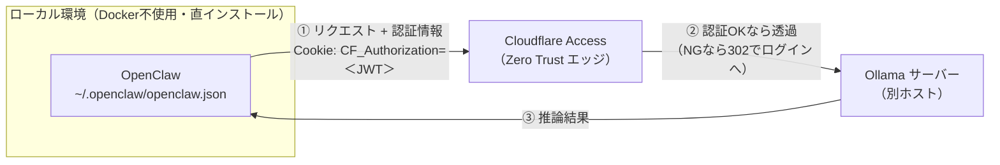

## 前提条件

- **OpenClaw**：Docker を使わず、ローカルに直接インストール（config は `~/.openclaw/openclaw.json`）
- **Ollama**：別ホストで稼働し、**Cloudflare Access（Zero Trust）** で保護されている
- **認証方式**：ユーザー JWT （サービストークンでの運用は未検証）
- **OpenClaw のバージョン**：calver（`2026.x.y`）。本記事は `2026.7.1` で検証。`headers` の振る舞いは版依存のため、`openclaw --version` を控えてから試すこと

OpenClaw はモデルプロバイダ（Ollama）に直接つなぐのではなく、間に Cloudflare Access が挟まる。この認証をどう越えたかが本記事のテーマ。



---

## サマリー

OpenClaw のモデルプロバイダを、**Cloudflare Access（Zero Trust）で守られた別サーバーの Ollama** につなぐ機会があった。**Cloudflare を介すため、接続に認証情報が必要だが、接続**セットアップ時のオンボーディング TUI 上では **base URL しか受け付けないためつまづいたという話。施した対策は以下(JWT使用)。**

- TUIで設定を行わず、設定ファイルの `models.providers.<id>.headers` に**認証情報を直書き(認証情報のenv化も検討したが、バージョンによってはバグが生じるという情報があったため、私は直書きで対応した)**。

以下は JWT で疎通確認済みの最小 config

```
{
  models: {
    providers: {
      ollama: {
        baseUrl: "<https://ollama.xxx>",
        api: "ollama",              // /v1 は付けない
        headers: {
          "Cookie": "CF_Authorization=＜JWT＞",
        },
        timeoutSeconds: 300,        // cold local model 対策
        models: [
          { id: "qwen3.6:27b", name: "qwen3.6:27b", input: ["text"] },
        ],
      },
    },
  },
  agents: {
    defaults: { model: { primary: "ollama/qwen3.6:27b" } },
  },
}
// ↑ この構成は JWT 経路で疎通確認済み
```

:::message
バージョン依存の挙動がある。`headers` フィールドの有無・挙動はバージョン依存で変わりうるので、試す前に `openclaw --version` を控えておく（OpenClaw は calver、例 `2026.x.y`）。
:::

---

## なぜ TUI で詰まったか

OpenClaw のオンボーディングは Ollama の接続先として base URL を 1 つ聞くだけで、任意ヘッダを付ける欄がない。

```
◇  Ollama base URL
│  <http://localhost:11434>
```

ここに直接 `https://ollama.xxx` を入れると、Access の認証リダイレクト（302 → ログインページ）に飛ばされ、URL しか渡せない TUI では越えられなかった。

---

## 認証の載せ方（configへの載せ方を間違えると弾かれる）

configへの載せ方にも注意が必要。私が引っかかったのが認証ヘッダ名。JWT のヘッダ名を `Cf-Access-Jwt-Assertion` に設定してしまい通らなかった。

`Cf-Access-Jwt-Assertion` は、認証成功後に **Cloudflare が origin へ向けて付ける下り方向専用**のヘッダで、「この人は認証済み」と origin に伝えるもの。クライアントがエッジに提示する認証情報の口ではない。エッジはこれを認証材料として読まず、リクエストを未認証扱いにして 302 リダイレクトする。

ユーザー JWT をエッジに提示する正しい口は **`CF_Authorization` クッキー。そのため** `headers` にはクッキーとして載せる。

```
headers: {
  "Cookie": "CF_Authorization=＜JWT＞",
}
```

### JWT とサービストークンの違い

今回私は JWT を使ったが、サービストークンを使う方が一般的だと思う。両者は載せ方が違うので注意。

|  | JWT（ユーザートークン） | Service Token |
| --- | --- | --- |
| 載せ方 | `Cookie: CF_Authorization=<JWT>` | `CF-Access-Client-Id` + `CF-Access-Client-Secret` ヘッダ |
| 取得 | 人間が `cloudflared access login` でブラウザ認証 | 管理者がダッシュボードで発行（静的） |
| 有効期限 | 短命・失効する（例：7 日） | 長期（Refresh 可） |
| identity | 個人の identity が乗る | 用途限定のマシン ID |

**JWT は「機構が動く」ことの確認には十分だが、恒久運用には向かない**（失効するたびに人間が取り直す必要がある）。常時運用するならサービストークンに寄せ、`headers` を次の形に差し替える。

:::message alert
**この形は私の方では未検証（参考までに）**
:::

```
headers: {
  "CF-Access-Client-Id": "＜service token id＞",
  "CF-Access-Client-Secret": "＜service token secret＞",
}
```

:::message
アプリ側(CloudFlare)のポリシーもサービストークンで認証を通すための設定が別途必要。
:::

---

## セキュリティ

- **私の場合はconfigにJWTを直書きしたが、JWTを環境変数へ逃すことも可能。**
- OpenClaw は config 値の中で `${VAR}` 形式の文字列置換を公式にサポートしている。`"Cookie": "CF_Authorization=${CF_JWT}"` のように書いて JWT 本体を config から出せる。置き場所は `~/.openclaw/.env` が公式に推奨されている（カレントディレクトリの `.env` は起動場所依存なので注意）。

:::message alert
**ただし `headers` 内の `${VAR}` は展開されないことがある。** HTTP 経由の headers ブロックで `${VAR}` 置換が効かず、`CF_Authorization=${CF_JWT}` がテキストのまま送られて 302 で弾かれたというバグの報告がある（2026.4.x 系で確認）。そのため私は env 化せず直書きで対応した。環境変数化するなら**自分のバージョンで実際に展開されるかを先に確かめる**ことを推奨する。
:::

- JWT は短期間で失効する上、コミット・共有さえしなければ漏洩面はローカルの config 1 つに限定される。問題なのはそれを**恒久運用や共有リポジトリに持ち込む**こと。
- サービストークンの secret も同様に平文保存を避け、環境変数や secret 管理に寄せる。ただし上の headers 展開バグは Client-Id / Client-Secret でも同様に生じうるので、`${VAR}` に頼る前に展開可否を確認する。
- OpenClaw はシェル実行等の実アクションを取り得るため、隔離環境での実行が推奨されている（Ollama 公式も isolated 環境を推奨）。私はローカル直で検証したが、恒久的には `docker-compose` 等で OpenClaw を隔離し、認証情報をコンテナの環境変数として渡す構成が望ましい。

---

## まとめ

1. `models.providers.<id>.headers` に認証を書く（TUI 使用だと書けないので config に入力）
2. JWT は `Cf-Access-Jwt-Assertion` ではなく **`CF_Authorization` クッキー**で提示する
3. 恒久運用は失効しないサービストークンへ（`CF-Access-Client-Id` / `CF-Access-Client-Secret`）。環境変数化は上記バグに注意。