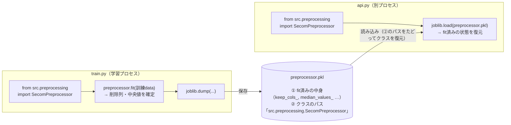

これは、半導体製造データ SECOM を題材にした不良予測プロジェクトの記録の一つ、「実装編」である。同じ1つのプロジェクトを、別々の角度から書いている。

- **考察編**（[記事](https://zenn.dev/yuya0408/articles/secom-defect-analysis)）― このデータが何を物語っているかを読み解く話
- **実装編（本記事）**― 分析結果を API・コンテナとして動かせる形にする話
- **運用編**（[記事](https://zenn.dev/yuya0408/articles/secom-defect-operations)）― 動かし続けるために何を監視し、異常を見つけたらどう動くかの話

前回の記事（考察編）では、半導体製造データ SECOM を題材に「予測精度を上げる」よりも「このデータが何を物語っているか読み解く」ことに徹した。厳密に評価するとAUCは0.60前後が現実的な上限で、最大の発見だった「品種ミックス」もモデルの精度向上には直接つながらなかった——そういう、やや地味な結論にたどり着いた。

ではその分析は無駄だったのか。私はそうは思わない。むしろ「精度が高くないモデルをどう扱うか」こそ、現場では本質的な問いだと考えている。

この記事は、その続きである。テーマは一貫して「**精度に限界のあるモデルでも、実際に動かせる形にして初めて、現場で使えるかどうかの土俵に乗る**」ということ。学習したモデルを保存し、APIとして提供し、コンテナ化して、誰が実行しても同じ結果が再現できる状態にするまでの一連の流れを扱う。

考察編が「データを読む力」の話だったとすれば、こちらは「分析結果を運用に乗せる技術」の話だ。コードは前回より多めに登場する。なお、ここで作るものはすべて[GitHubのリポジトリ](https://github.com/yuya0408/secom-defect-prediction)に置いてある。

正直なところ、これまで私はデータ分析をほぼノートブックの中だけで完結させてきた。セルを上から実行して結果が出れば十分で、「ノートブックで動く」こと自体がゴールになっていた。今回はじめて API 化と Docker 化に向き合い、「ノートブックで動く」と「誰の環境でも同じように動く」の間にある壁の大きさを実感した。実装自体はAIの力も借りて素早く形にできたが、肝心だったのはその先だ。出来上がったものを別プロセスから読み、壊れていないかを確かめる過程で、「なぜコンテナ化や再現性がこれほど重視されるのか」を身をもって理解できた。それが一番の収穫だった。

:::message
私は元・電子部品メーカーの製造技術職で、現在はIT業界に転じてエンジニア歴1年未満。MLOpsの専門家でもなく、本記事で扱う API 化・コンテナ化・CI もほとんどが初挑戦だった。「現場で使われる形にするには何が要るのか」を手を動かして確かめた記録であり、ベストプラクティスの教科書ではない。
:::

---

## 0. 前提：考察編でわかったこと（本記事から読む方へ）

本記事は単独でも追えるが、前提となる[考察編](https://zenn.dev/yuya0408/articles/secom-defect-analysis)の結論を先に共有しておく。ここで扱うモデルが「なぜ精度に限界があるのか」の背景になる。

- **SECOMとは**：半導体製造工程の590個のセンサー値から不良を予測するデータセット（サンプル1,567件、不良率6.64%の強い不均衡、センサーは匿名化）。もともとは予測用ではなく「因果的特徴量選択」のベンチマークで、著者自身がプロセスと不良の因果は限定的だと述べている。**高い精度が出にくいのは設計上の前提**だ。
- **精度の現実**：当初は特徴量選択で AUC 0.72 が出たが、その正体は特徴量選択やしきい値最適化を交差検証の外でやってしまったデータリークだった。学習の全工程を各foldの訓練データ内に閉じ込め、時系列で分割して測り直すと、**AUC は 0.60 前後（PR-AUC 0.1346、ランダムの約2倍）が現実的な上限**。凝った前処理や時系列特徴量よりも「きちんとした前処理 + Random Forest」というシンプルな構成が最良だった。
- **最大の発見「品種ミックス」**：センサーの欠損パターンでサンプルを分けると、不良率が 0%〜23% とまるで違うグループに分かれた。同じラインに複数の品種が入れ替わり流れている構造だ。ただし ①グループあたりのサンプルが少ない ②時系列で未知の品種が次々現れる（ドリフト） ③既存の欠損フラグに品種情報が既に含まれていた、という3点から、**データ理解には決定的でも、モデルの精度向上には直接つながらなかった**。
- **結論**：SECOM の難しさは「モデリング」ではなく「データ理解」にある。無理に高スコアを演出するより、精度に限界があることを前提に扱う方が、このデータには合っている。

本記事は、この「精度に限界のあるモデル」を、実際に動かせる形（API・コンテナ）にするまでの話だ。

---

## 1. この記事で作るもの

最終的に作るのは、センサー値を投げると「不良である確率」が返ってくる推論APIだ。`curl` でこう叩くと、

```bash
curl -X POST http://localhost:8000/predict \
  -H "Content-Type: application/json" \
  -d @sample_input.json
```

こう返ってくる。

```json
{"defect_probability": 0.6597, "is_defect": true, "threshold": 0.5}
```

これを Docker で包み、`docker compose up` の一発で誰でも同じものを立ち上げられるところまで持っていく。

リポジトリの構成は次の通り。考察編のノートブックや図表と、実装編のコードを1つのリポジトリにまとめている。同じ1つのプロジェクトを別の角度から語った2本の記事なので、コードを分散させたくなかったからだ。

```text
secom-defect-prediction/
├── README.md
├── requirements.txt          # 再現のための固定バージョン
├── Dockerfile
├── docker-compose.yml
├── sample_input.json         # 動作確認用サンプル（実データの不良行1件）
├── src/
│   ├── preprocessing.py      # 前処理クラス（リーク防止 / 独立モジュール）
│   ├── train.py              # 最終モデルの学習と保存
│   └── api.py                # FastAPI 推論サーバー
├── models/                   # 学習済み preprocessor / model / metadata
├── data/                     # secom.data, secom_labels.data, secom.names（UCI 公式）
├── notebooks/                # 考察編の分析ノートブック
├── reports/figures/          # 考察編の図表
├── tests/test_api.py         # pytest
└── .github/workflows/ci.yml  # 学習 → テストの CI
```

この記事では `src/` 配下の3ファイルと、Docker・テスト周りを順に見ていく。

---

## 2. 最初の関門：学習済みモデルの「持ち運び」

ノートブックから運用へ出るときに最初にぶつかり、理解に一番時間をかけたのがここだった。先に結論を書いておくと、**ノートブックの中で定義したクラスを使って保存したモデルは、別プロセスのAPIからそのままでは読み込めない**。

考察編の前処理は、scikit-learn の作法に沿って自作のクラス（`SecomPreprocessor`）にまとめてあった。学習時の統計量だけを使って変換するので、テストデータの情報が漏れない（リークしない）構造になっている。これをノートブックで学習させ、`joblib` で保存する。

```python
import joblib
joblib.dump(preprocessor, "models/preprocessor.pkl")
joblib.dump(model, "models/model.pkl")
```

ここまでは何の問題もない。ノートブックの中で読み戻すこともできる。ところが、これをAPI（別のPythonプロセス）から読もうとすると、こうなる。

```text
AttributeError: Can't get attribute 'SecomPreprocessor' on <module '__main__'>
```

なぜか。`joblib`（中身は pickle）が保存するのは、**クラスの中身そのものではなく「そのクラスがどのモジュールに定義されているか」というパス情報だけ**だからだ。ノートブックで定義したクラスは `__main__.SecomPreprocessor` というパスで記録される。`joblib.load` はそのパスをたよりに、読み込む側の環境からクラスを import しようとするだけ。API プロセスの `__main__` に `SecomPreprocessor` は存在しないので、探しに行った先が空振りになって復元に失敗する。

これは前処理に限らず、自作クラスを pickle 化するときに普遍的にハマるポイントだと思う。

解決策はシンプルだ。**クラスを独立した `.py` モジュールに切り出し、学習側もAPI側も同じパスから import する**。

```python
# 学習側・API側、どちらも同じこの一行で参照する
from src.preprocessing import SecomPreprocessor
```

こうすると pickle に記録されるパスは `src.preprocessing.SecomPreprocessor` で一貫し、`src.preprocessing` を import できるプロセスならどこからでも復元できる。地味だが、これが今回の実装の背骨になっている。「分析はノートブックで完結するが、運用はそうではない」という当たり前の事実を、エラーメッセージで突きつけられた格好だった。

学習プロセスとAPIプロセスの関係を図にすると、こうなる。鍵は、pkl に「① fit済みの中身」と「②クラスのパス」の両方が入っていて、両プロセスが同じ import パスを共有するからこそ②をたどって復元できる点だ。



---

## 3. 前処理をクラスとして切り出す

というわけで、前処理クラスを `src/preprocessing.py` に置く。考察編の8ステップの前処理を、`fit`／`transform` に整理したものだ。要点だけ抜き出すとこうなる。

```python
from sklearn.base import BaseEstimator, TransformerMixin

class SecomPreprocessor(BaseEstimator, TransformerMixin):
    def fit(self, X, y=None):
        df = pd.DataFrame(X)
        df.columns = [str(c) for c in df.columns]

        # 1. 定数列、2. 準定数列、3. 高欠損列 を「訓練データから」検出
        self.constant_cols_ = df.columns[df.nunique() <= 1].tolist()
        # （準定数・高欠損列の検出は省略）

        # 5. 補完用の中央値も「訓練データから」算出して保持
        self.median_values_ = df[self.keep_cols_].median()
        return self

    def transform(self, X):
        df = pd.DataFrame(X)
        df.columns = [str(c) for c in df.columns]
        kept = df[self.keep_cols_].copy()
        # 4. 欠損フラグ化 → 5. 学習時の中央値で補完
        flags = kept[self.flag_cols_].isna().astype(int)
        kept = kept.fillna(self.median_values_)
        return pd.concat([kept, flags], axis=1).values
```

ポイントは、削除する列の判定も、補完に使う中央値も、**すべて `fit` の中で「訓練データから」決め、`transform` ではそれを適用するだけ**にしていること。考察編で痛い目を見たデータリークを、構造として防いでいる。本番運用で1件のデータが来たときも、学習時に決めた同じルールで変換されるので、評価時と本番で挙動がずれない。

逆に言えば、API側でこのクラスを `fit` し直してはいけない。本番に届く1件のデータで `fit` すると、削除列も中央値も学習時と別物になり、未来のデータの情報を使うリークにもなる。だからAPIでは `fit` を呼ばず、学習時に確定した状態を読み込んで `transform` するだけにしている（その「状態の持ち運び」が第2章の話だ）。

`BaseEstimator` / `TransformerMixin` を継承しているのは、scikit-learn の `Pipeline` に組み込めるようにするためと、`get_params` などの作法を自動で満たすためだ。

---

## 4. 最終モデルを学習して保存する

前処理クラスができたら、最終モデルを学習して保存するスクリプト `src/train.py` を用意する。考察編の結論である「きちんとした前処理 + Random Forest」を、全データで学習し直すものだ。

```python
from src.preprocessing import SecomPreprocessor  # ← 同じパスから import
from sklearn.ensemble import RandomForestClassifier
import joblib

def main():
    df, y = load_data()  # secom.data / secom_labels.data を読む

    preprocessor = SecomPreprocessor()
    X = preprocessor.fit_transform(df)

    model = RandomForestClassifier(
        n_estimators=200, max_depth=10, class_weight="balanced",
        random_state=42, n_jobs=-1,
    )
    model.fit(X, y)

    # 前処理・モデル・メタデータの3点を保存
    joblib.dump(preprocessor, "models/preprocessor.pkl")
    joblib.dump(model, "models/model.pkl")
    joblib.dump(metadata, "models/metadata.pkl")
```

実行するとこうなる。

```text
$ python -m src.train
データ読み込み: (1567, 590)  不良率 6.64%
前処理サマリー: {'constant_removed': 116, 'quasi_constant_removed': 10,
               'high_missing_removed': 28, 'kept_columns': 436,
               'missing_flags_added': 24}
入力特徴量数: 590  ->  前処理後: 460
```

590個の生の特徴量が、前処理後は460個（残った436列 + 欠損フラグ24列）になる。この「**入力は590、モデルが食うのは460**」という変換を前処理クラスが吸収してくれるので、APIの利用者は生の590個を渡すだけでよくなる。

ここで `metadata.pkl` という3つ目のファイルを一緒に保存しているのが、地味だが効く工夫だ。中身はモデルの種類、入力特徴量数、学習サンプル数、そして**厳密評価で得た真のAUC（0.6074）**などの記録。「このモデルは何者で、どれくらいの実力なのか」をモデル自身に持たせておくと、後でAPIの `/metadata` エンドポイントからそのまま返せる。精度に限界があるモデルほど、その限界値を成果物自身に持たせておく意味は大きい。

`metadata` にはもうひとつ、**モデルの版（`version`）と学習日時（`trained_at`）**も入れている。そしてその版を、推論APIのレスポンスにも `model_version` として刻むようにした。

```json
{"defect_probability": 0.6597, "is_defect": true, "threshold": 0.5, "model_version": "1.0.0"}
```

一見どうでもいい一項目に見えるが、これは再学習やドリフト監視に踏み込んだときに効いてくる。「この不良確率は、いつ学習したどの版のモデルが出したのか」を予測1件ごとにログから辿れる。版が分からなければ、新旧モデルの比較も、問題が起きたときのロールバックもできない。再現性と地続きの、運用の土台である。

---

## 5. FastAPIで推論APIを作る

いよいよ `src/api.py`。FastAPI を選んだのは、型を定義するだけで入力バリデーションと Swagger UI（APIドキュメント）が自動生成され、少ないコードで「試せる」状態になるからだ。今回が初めてのFastAPIだったが、迷う場面は少なかった。

まず、起動時にモデルを読み込む。ここで `src.preprocessing` を import しておくのが、第2章で見た復元の鍵になる。

```python
import joblib
from fastapi import FastAPI
# この import があることで joblib.load が SecomPreprocessor を復元できる
from src.preprocessing import SecomPreprocessor  # noqa: F401

preprocessor = joblib.load("models/preprocessor.pkl")
model = joblib.load("models/model.pkl")
metadata = joblib.load("models/metadata.pkl")

app = FastAPI(title="SECOM 不良予測 API")
```

入出力は Pydantic のモデルで定義する。590個ちょうどでなければ弾くバリデーションを入れておく。欠損しているセンサーは `null` で受け取れるようにして、補完はAPI側（学習済みの中央値）に任せる。

```python
from pydantic import BaseModel, Field, field_validator
from typing import List, Optional

N_FEATURES = metadata["input_features"]  # 590

class PredictRequest(BaseModel):
    features: List[Optional[float]] = Field(..., description="590個のセンサー値（欠損はnull可）")
    threshold: Optional[float] = Field(None, ge=0.0, le=1.0)

    @field_validator("features")
    @classmethod
    def _check_length(cls, v):
        if len(v) != N_FEATURES:
            raise ValueError(f"features は {N_FEATURES} 要素である必要があります（受信: {len(v)}）")
        return v
```

推論本体はごく短い。生の値を前処理クラスに通し、モデルの確率を返すだけだ。

```python
@app.post("/predict")
def predict(req: PredictRequest):
    threshold = req.threshold if req.threshold is not None else 0.5
    raw = pd.DataFrame([req.features])     # 列名 0..589 のDataFrame
    X = preprocessor.transform(raw)        # 590 -> 460 に変換
    proba = float(model.predict_proba(X)[:, 1][0])
    return {
        "defect_probability": proba,
        "is_defect": proba >= threshold,
        "threshold": threshold,
    }
```

エンドポイントは全部で5つ。`/`（概要）、`/health`（ヘルスチェック）、`/metadata`（モデル情報）、`/predict`（1件）、`/predict/batch`（複数件）。

起動して `http://localhost:8000/docs` を開くと、FastAPI が生成した Swagger UI から、ブラウザだけで全エンドポイントを試せる。

```bash
uvicorn src.api:app --reload
```

### しきい値を引数にした理由

ひとつ設計で迷ったのが、不良と判定するしきい値だ。不均衡データなので、確率0.5を境にすると、ほぼ全部が「合格」に倒れてしまう。考察編でも触れたが、最適なしきい値は「不良を見逃すコスト」と「過検出のコスト」のバランス次第で大きく変わる。

なので、しきい値はモデルに焼き付けず、リクエストごとに指定できるようにした（省略時は0.5）。「どこで線を引くか」は技術ではなくビジネス側の判断だ、という考察編の結論を、APIの設計にそのまま反映した形だ。

```bash
# 同じ入力でも、しきい値を下げれば拾いやすくなる
curl ... -d '{"features": [...], "threshold": 0.3}'
```

---

## 6. 590個の入力をどう用意するか

ここで現実的な問題にぶつかる。APIをテストしたくても、**590個のセンサー値を手で書くのは非現実的**だ。

そこで、テストデータの実際の1行から入力JSONを生成するスクリプトを用意した。デモとして分かりやすいよう、「実際に不良だった行」を選ぶようにしている。

```python
# scripts/make_sample_input.py の要点
row = df.iloc[fail_idx].tolist()
# NaN は JSON の null に変換（API の欠損補完を試すことにもなる）
features = [None if math.isnan(v) else float(v) for v in row]
json.dump({"features": features}, open("sample_input.json", "w"))
```

これで生成した `sample_input.json` を投げると、不良行は確率0.66で「不良」と判定される。試しに合格行を入れると0.087まで下がる。限界はあるモデルとはいえ、不良行と合格行はちゃんと区別できている。

```bash
# 不良行
{"defect_probability": 0.6597, "is_defect": true,  "threshold": 0.5}
# 合格行
{"defect_probability": 0.0870, "is_defect": false, "threshold": 0.5}
```

「テスト用の入力をどう用意するか」は地味な作業だが、こういう小さな摩擦を消しておくと、リポジトリを開いた人がすぐ試せる。READMEに `curl` 一行で動く例を載せられるのも、このサンプルがあるおかげだ。

---

## 7. Dockerで再現可能にする

ローカルで動いても、「私の環境では動く」では運用に乗らない。Docker で包んで、環境ごと持ち運べるようにする。

```dockerfile
FROM python:3.12-slim

ENV PYTHONUNBUFFERED=1 PYTHONDONTWRITEBYTECODE=1
WORKDIR /app

# 依存だけ先に入れてレイヤーキャッシュを効かせる
COPY requirements.txt .
RUN pip install --no-cache-dir -r requirements.txt

# アプリ本体と学習済みモデルをコピー
COPY src/ ./src/
COPY models/ ./models/

EXPOSE 8000
CMD ["uvicorn", "src.api:app", "--host", "0.0.0.0", "--port", "8000"]
```

Docker は命令ごとに結果をキャッシュし、変更があった命令から下を作り直す。requirements.txt のコピーと pip install をコード copy より前に置けば、コードだけ直したビルドでは依存インストールがキャッシュされ、再実行されずに済む。

イメージには `src/` と `models/` だけを入れ、データ・ノートブック・図表は `.dockerignore` で除外している。推論サーバーに分析の生データは要らないからだ。

`docker-compose.yml` を用意すれば、起動はワンコマンドになる。ヘルスチェックも入れておいた。

```bash
docker compose up --build
curl http://localhost:8000/health
# {"status": "ok", "model_loaded": true}
```

:::message
クラウドへの実デプロイ（Cloud Run など）までは、この記事では踏み込んでいない。認証情報やコストの絡む部分まで公開リポジトリで再現するのは別の論点になるので、ここでは「Docker イメージにまとめ、どの環境でも同じものが動く」状態をゴールにした。
:::

### おまけ：ブラウザから試せるデモ（Hugging Face Spaces）

`curl` だけだと触り心地が伝わりにくいので、ブラウザから試せる Gradio デモ（`app.py`）も用意し、Hugging Face Spaces に載せた。[こちらのデモ](https://huggingface.co/spaces/yuya-h/secom-defect-demo)から、誰でもクリックで不良確率を確かめられる。

ポイントは、**このデモが推論APIとまったく同じ前処理クラス・モデルを読み込んでいる**こと。`from src.preprocessing import SecomPreprocessor` で同じ pkl を復元するので、デモと本番サービングで結果が一致する。第2章の「持ち運び」の工夫が、API だけでなくデモUIにもそのまま効いている。

学習済みモデルそのものを配りたい場合は、Hugging Face Hub のモデルリポジトリとして公開する手もある。その際は用途・厳密評価値・限界を書いた「モデルカード」を添える。精度に限界があるモデルを公開する以上、「どこまで信じてよいか」を成果物自身に添えておく（メタデータに版を刻んだのと同じ発想だ）。

---

## 8. テストとCIで「動き続ける」ことを保証する

ここまでで動くものはできた。だが「いま動く」ことと「これからも動く」ことは別だ。コードを直したり依存を上げたりしたときに、静かに壊れていないかを自動で確かめたい。

`pytest` で、FastAPI の `TestClient` を使ってAPIを叩くテストを書いた。サーバーを別途起動しなくても、テストプロセスの中でAPIを呼べる。

```python
from fastapi.testclient import TestClient
from src.api import app

client = TestClient(app)

def test_health():
    assert client.get("/health").json()["model_loaded"] is True

def test_pass_row_scores_lower_than_fail_row():
    # 既知の不良行は、既知の合格行より高い確率になるはず
    p_fail = client.post("/predict", json={"features": fail_row}).json()["defect_probability"]
    p_pass = client.post("/predict", json={"features": pass_row}).json()["defect_probability"]
    assert p_fail > p_pass

def test_wrong_length_is_rejected():
    # 590個でなければ 422 で弾かれる
    assert client.post("/predict", json={"features": [1, 2, 3]}).status_code == 422
```

`test_pass_row_scores_lower_than_fail_row` のように、**「不良行のほうが合格行より高い確率になる」という最低限の振る舞い**をテストにしておくと、前処理やモデルの読み込みが壊れたときに気づける。精度の絶対値は低くても、この大小関係が崩れたら何かがおかしい、というモデル特有のテストだ。

さらに GitHub Actions で、push のたびに「学習 → テスト」を回す。`models/` をリポジトリに含めているとはいえ、CIで `python -m src.train` から走らせることで、**データさえあれば誰でもゼロからモデルを再現できる**ことを毎回保証している。

```yaml
# .github/workflows/ci.yml の要点
- run: pip install -r requirements-dev.txt   # 本番 + テスト依存をまとめて
- run: python -m src.train   # data/ から models/ を再生成
- run: pytest -q
```

### 本番依存とテスト依存を分ける

上のCI設定で `requirements-dev.txt` を入れているのには理由がある。CIを回すと、ローカルでは通っていたテストが、CI環境だけで失敗した。原因は `httpx` が入っていなかったこと。FastAPI の `TestClient` は内部で `httpx` を使うが、これは**テストのときにしか要らない**依存で、ローカルにたまたま入っていたために表に出ず、まっさらなCI環境で初めて露見した。push のたびにゼロから環境を作り直すCIが、ローカルの「たまたま動く」を先回りして暴いてくれた格好だ。

そこで「APIを動かすのに必要な依存」と「テストのときだけ必要な依存」を分けた。前者は `requirements.txt`、後者は `requirements-dev.txt` に置く。

```text
# requirements-dev.txt（開発・テスト用。本番には不要）
-r requirements.txt   # 本番依存もまとめて取り込む
pytest==9.0.3
httpx==0.28.1         # TestClient が内部で使う
```

`pytest` や `httpx` を本番イメージに含める必要はないし、APIだけ使いたい人にテストツールまで入れさせるのも無駄だ。依存を役割で分けておくと、Dockerイメージが軽くなるうえ、「ローカルでは動くがCIでは動かない」という取りこぼしにも気づきやすくなる。

---

## 9. 再現性は、バージョン固定から

最後に、地味だが効いたこと。`requirements.txt` のバージョンをすべて固定した。

```text
scikit-learn==1.8.0
pandas==3.0.2
numpy==2.4.4
joblib==1.5.3
fastapi==0.136.3
...
```

なぜ固定するか。`joblib` で保存したモデルは、**保存したときと違うバージョンの scikit-learn で読み込むと、警告が出たり、最悪は復元に失敗したりする**ことがある。モデルを生成した環境と、APIが動く環境のライブラリバージョンを揃えておくことで、この種の「環境が違うと動かない」を防げる。

考察編で「リークを疑う」ことに時間を使ったのと同じで、実装編では「環境差を疑う」ことに気を配った。再現できない分析・動かないモデルは、どれだけ中身が良くても運用には乗らない。

---

## 結び

考察編は「データを使う前に、まず読む」話だった。この実装編は、その読み解いた結果を「実際に動かせる形にする」話だった。

振り返ると、技術的な山場は派手なものではなかった。一番効いたのは、前処理クラスを独立モジュールに切り出して `joblib` のパスを揃える、という地味な一手だ。FastAPI も Docker も、世の中に情報があふれている定番の組み合わせで、特別なことはしていない。

それでも、この一連の流れを通して強く感じたことがある。**分析と運用は地続きではない**。ノートブックの中で完結していたものを、別プロセスから読み、誰の環境でも動かし、壊れていないことを保証する——その一つひとつに、分析とは別の種類の配慮が要る。精度0.60のモデルでも、ここまでやって初めて「現場で使うかどうか」を議論する土俵に乗る。

製造業にいた頃、「検査で弾く」より「不良そのものを減らす」ことが重視されていた。この推論APIは事後検知にすぎず、不良の発生を止めるものではない。それでも、検査の優先順位付けやモニタリングの入口として、現場で使える形にはなった。データを読む力と、それを運用に乗せる技術。その両方があって、ようやく分析は現場に届くのだと思う。

コードは[GitHub](https://github.com/yuya0408/secom-defect-prediction)に公開している。考察編・運用編とあわせて、興味があれば覗いてみてほしい。
